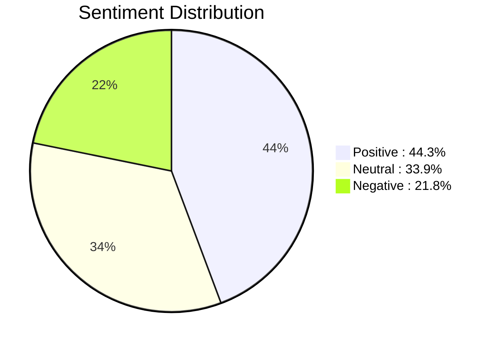
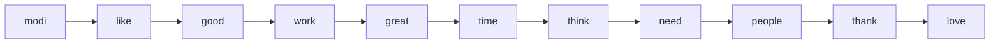

# Sentiment Analysis of Twitter and Reddit Reviews


## 📌 Project Overview
This project performs comprehensive sentiment analysis on user-generated reviews from Twitter and Reddit to classify text as **positive**, **negative**, or **neutral**. The analysis includes:
- Advanced text preprocessing and normalization
- Feature extraction using TF-IDF vectorization
- Exploratory data analysis and visualization
- Data preparation for machine learning models

## 🗂️ File Structure
```
sentiment_analysis/
├── data/
│   ├── Twitter_Data.csv         # 162,980 training samples
│   └── Reddit_Data.csv          # 37,249 testing samples
├── notebooks/
│   └── Sentiment_analysis.ipynb # Main analysis notebook
├── README.md                    # Project documentation
└── requirements.txt             # Python dependencies
```

## 📊 Key Statistics
| Metric | Value |
|--------|-------|
| **Total Samples** | 200,229 |
| **Training Samples** | 162,980 |
| **Testing Samples** | 37,249 |
| **Max Sequence Length** | 44 words |
| **Mean Sequence Length** | 14.55 words |
| **90th Percentile Length** | 26 words |

## 🔍 Sentiment Distribution


## 🧹 Text Preprocessing Pipeline
1. **Lowercasing** - Convert all text to lowercase
2. **URL Removal** - Eliminate web addresses
3. **Punctuation Handling** - Remove special characters
4. **Emoji Handling** - Convert emojis to text descriptions
5. **Stopword Removal** - Eliminate common words
6. **Stemming** - Reduce words to root form
7. **Short Review Filtering** - Remove reviews with <2 words

```python
def preprocessing(text):
    text = str(text).lower()
    text = re.sub(r"http\S+", "", text)          # Remove URLs
    text = re.sub(r"[^a-zA-Z]", " ", text)        # Remove punctuation
    text = re.sub(r"\s+", " ", text)              # Remove extra spaces
    text = re.sub(r'(.)\1{1,}', r'\1', text)      # Handle repeated characters
    text = emoji.demojize(text)                   # Convert emojis
    text = [port_stemmer.stem(word) for word in text.split() 
            if word not in stopwords]             # Stemming and stopword removal
    return " ".join(text)
```

## 📈 Exploratory Data Analysis

### Sequence Length Distribution


### Top 10 Important Words


## ⚙️ Feature Extraction
Text data is converted to numerical features using **TF-IDF Vectorization**:

```python
from sklearn.feature_extraction.text import TfidfVectorizer

# Initialize TF-IDF vectorizer
vectorizer = TfidfVectorizer()

# Transform training and testing data
x_train = vectorizer.fit_transform(x_train)
x_test = vectorizer.transform(x_test)

print(f"Vocabulary size: {len(vectorizer.vocabulary_):,} words")
print(f"Training matrix shape: {x_train.shape}")
print(f"Testing matrix shape: {x_test.shape}")
```

## 🚀 Getting Started
### Prerequisites
- Python 3.7+
- Jupyter Notebook

### Installation
1. Clone the repository:
```bash
git clone https://github.com/yourusername/sentiment-analysis.git
cd sentiment-analysis
```

2. Install dependencies:
```bash
pip install -r requirements.txt
```

3. Launch Jupyter Notebook:
```bash
jupyter notebook notebooks/Sentiment_analysis.ipynb
```

## 📚 Dependencies
| Package | Version | Purpose |
|---------|---------|---------|
| pandas | ≥1.0 | Data manipulation |
| numpy | ≥1.18 | Numerical operations |
| scikit-learn | ≥0.24 | Machine learning |
| nltk | ≥3.5 | NLP processing |
| matplotlib | ≥3.3 | Visualization |
| seaborn | ≥0.11 | Enhanced visualization |
| regex | ≥2020.0 | Advanced text processing |
| emoji | ≥1.2 | Emoji handling |

## 🔜 Next Steps
1. **Model Training** - Implement and compare:
   - Logistic Regression
   - Support Vector Machines
   - Random Forest
   - Neural Networks

2. **Model Evaluation** - Analyze using:
   ```python
   from sklearn.metrics import classification_report, confusion_matrix, accuracy_score
   ```

3. **Deployment** - Create a web application with:
   ```python
   from flask import Flask, request, jsonify
   ```

4. **Advanced Techniques** - Explore:
   - BERT and Transformer models
   - Topic modeling
   - Aspect-based sentiment analysis

## 🙏 Acknowledgments
This project utilizes:
- Natural Language Toolkit (NLTK) for text processing
- Scikit-learn for machine learning utilities
- Matplotlib and Seaborn for visualizations

---

**For the complete implementation, explore the [Jupyter Notebook](notebooks/Sentiment_analysis.ipynb)**
